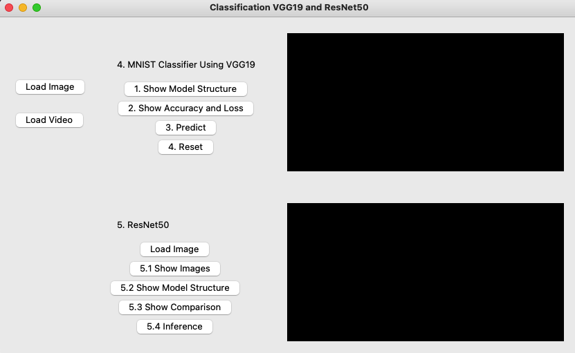

# VGG19 and ResNet50 for Classification Task

*Discription:*

***1.In this project, we implemented two convolutional neural network architectures, namely VGG19 and ResNet50, for the task of image classification.***

**1.Requirements and dependencies**
  * Python 3.8 (https://www.python.org/downloads/)
  * Opencv-contrib-python (3.4.2.17)
  * Matplotlib 3.7.3
  * UI framework: pyqt5 (5.15.10)
  * Pytorch 2.1.0
  * Torchvision 0.16.0
  * Torchsummary 1.5.1
  * Tensorboard  2.14.0
  * Pillow 10.1.0

**2.Usage:**

1. Downloads whole repository.
2. Download the pre-train model.
4. Run the `Main.py` and follow the steps .

## 1.VGG19-MNIST

1.Objective :
  
  * Practice handwriting numbers and dog/cat classifications.

2.Predict the handwriting numbers :

  * Load VGG19 with BN pre-train model with highest validation accuracy which trained at Repositories ([Train VGG19 and ResNet50](https://github.com/Kung-hen/Train-VGG19-and-ResNet50)).
  * Draw a number on graffiti board using mouse.
  * Click the button `3.Predict` to run inference on the image you drew.
      * Show the predicted class label on the GUI.
      * Show the probability distribution of model predictions using a histogram in a new window.
  * Click the button `4.Reset` to clear the graffiti board.

https://github.com/Kung-hen/MNIST-VGG19-and-Animal-ResNet50-Classifier/assets/95673520/92eeaa90-2d33-4d28-893c-ed37d4a7935f

## 2.ResNet50 Cat/Dog

1.Objective :
  
  * Learn how to train a ResNet50 model to classify images of cats and dogs using PyTorch.

2. Predict the Cat/Dog :

https://github.com/Kung-hen/MNIST-VGG19-and-Animal-ResNet50-Classifier/assets/95673520/8f2b3d6d-1985-4070-9593-1be4d6f6c6e4

